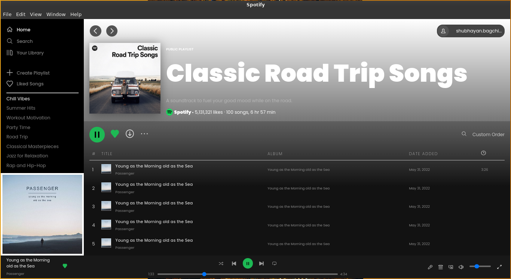

# Spotify Desktop App

This is a static Spotify desktop application built using HTML5, CSS3, and Electron. The application is a replica of the Spotify desktop interface, showcasing the layout and design elements.

## Screenshots

## Installation

To run the application locally, follow these steps:

1. Clone this repository to your local machine using:
   git clone https://github.com/S11UB11AYAN/spotify-desktop-app.git

2. Navigate into the project directory:
   cd spotify-desktop-app

3. Install dependencies using npm:
   npm install

4. Start the application:
   npm start

## Contributing

If you'd like to contribute, feel free to fork this repository, make your changes, and submit a pull request. Any contributions are greatly appreciated!

1. Fork this repository.
2. Create a new branch for your feature or bug fix:
   git checkout -b feature/your-feature-name
3. Make your changes and commit them:
   git commit -am 'Add some feature'
4. Push to the branch:
   git push origin feature/your-feature-name
5. Submit a pull request.

## License

This project is licensed under the MIT License - see the [LICENSE](LICENSE) file for details.
